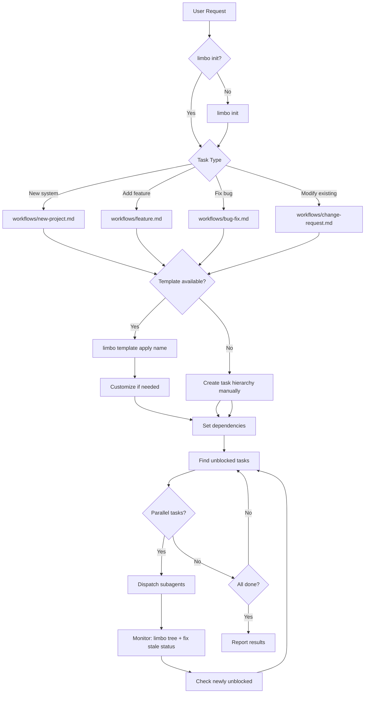

# Project Manager Skill

Decompose work into hierarchical tasks (limbo) and dispatch parallel subagents.

## Prerequisite Check

Before doing anything else, verify `limbo` is installed:

```bash
command -v limbo >/dev/null 2>&1 && echo "OK" || echo "MISSING"
```

If `MISSING`: **STOP.** Tell the user: "limbo CLI is not installed. Install it before using /swe-team:project-manager." Do NOT attempt to work around this — limbo is required for task tracking, dependency management, and status rollup.

## ⚠️ CRITICAL REQUIREMENTS

- **Execute fully when invoked as subagent**: When launched via the Agent tool (i.e., you are a subagent), the parent agent has already decided to act. Do NOT return a plan and ask "shall I proceed?" — plan, execute, commit, push, and return results. The parent's prompt IS the green light. Only pause for confirmation if you encounter a genuinely ambiguous or destructive situation the prompt didn't anticipate.
- **Multi-repo workflows**: When tasks span multiple Git repositories, the final commit/push step must cover ALL repos with changes. Before returning results, run `git status` in every repo you touched and ensure nothing is left uncommitted. Use `/swe-team:git-commit` for each repo separately. Do NOT return with dirty working trees.
- **Update upstream indexes when creating skills or tools**: When a task creates a new skill in the swe-team plugin, include a task to add it to SKILLS-INDEX.md (the canonical skill registry) and update the swe-team README.md skill table. After changes, run `claude plugin update swe-team@claudehub` to sync the plugin cache. When a task creates a new CLI tool with a Homebrew formula, include a task to add brew install instructions to the tool's README and add it to the swe-team "Tool Setup" section. Missing index entries make new work invisible.
- **Structured task fields**: Every `limbo add` MUST include `--action`, `--verify`, and `--result` flags. Every `limbo status <id> done` MUST include `--outcome "..."`. These are enforced by the CLI and will error if omitted.
- **Block order**: `limbo block <blocker> <blocked>` — first arg blocks the second
- **Parallel dispatch**: Use multiple Task tool calls in a SINGLE message
- **Concurrency limit**: Max 3-5 subagents at once
- **File conflicts**: NEVER parallelize tasks modifying the same files. Before dispatch, enumerate every file each agent will touch and check for overlaps. Test files are the most common offender — see [orchestration/parallel.md](orchestration/parallel.md#shared-file-partitioning)
- **Verify before dispatch**: Check `blockedBy` is empty before assigning
- **IDs are strings**: limbo IDs are 4-char strings (e.g., `unke`), not integers
- **Scope-bound subagent prompts**: Every subagent prompt MUST list the files it is allowed to modify AND the files it must NOT touch. Subagents that go beyond their assigned files create conflicts with parallel agents and make downstream tasks partially pre-done or broken. See [orchestration/parallel.md](orchestration/parallel.md#-critical-scope-bound-subagent-prompts)
- **Research source files before writing subagent prompts**: Before dispatching, use an Explore agent to research the files each subagent will modify — extracting only the relevant functions, signatures, and surrounding context. Also extract signatures from callee files (files the modified code calls into) so prompts include correct types and APIs. Do NOT read entire files into the orchestrator's context. Do NOT write prompts from plan descriptions alone. Subagents succeed when prompts contain precise code context; the orchestrator succeeds by protecting its context window.
- **Subagent prompts MUST include verification steps**: Every code-writing subagent must build AND runtime-test its output. "It imports" / "it compiles" is not done — reach at least Level 3 (static analysis) on the verification depth ladder. For non-runnable code (TUI, GUI, interactive), explicitly verify library attributes exist and unit-test pure logic helpers. See [orchestration/parallel.md](orchestration/parallel.md#-critical-always-include-verification-steps)
- **Subagent prompts MUST include edge cases**: The orchestrator has full context; subagents don't. Spell out edge cases (spaces in strings, empty inputs, quoting rules) explicitly in the prompt. See [orchestration/parallel.md](orchestration/parallel.md#-critical-include-edge-case-analysis-in-subagent-prompts)
- **Subagent prompts for filesystem operations MUST specify exact paths and commands**: When delegating filesystem operations (symlinks, file moves, directory creation) to subagents, specify the exact source path, exact target path, and exact command to run. Do not assume the subagent will infer the correct working directory or intent. Bad: "recreate symlinks with absolute paths". Good: "For each skill in ~/.claude/skills/ that uses a relative symlink, run: `ln -sf /absolute/path/to/source ~/.claude/skills/skill-name`". Vague filesystem instructions have caused subagents to run commands in the wrong directory (e.g., creating circular symlinks inside skill source directories instead of in the installation directory).
- **Subagent prompts that rewrite existing code MUST list preserved behaviors**: When replacing a function/block, enumerate what the old code did (timing, logging, error format, return data shape). Subagents can't infer what they're replacing. See [orchestration/parallel.md](orchestration/parallel.md#-critical-preserve-existing-behavior-when-rewriting-code)
- **Orchestrator owns limbo status**: Do NOT include `limbo claim`, `limbo status`, or `limbo note` commands in subagent prompts. Subagents unreliably execute them. The orchestrator must `limbo claim` before dispatch and `limbo status done` after verifying each agent's result.
- **Integration checkpoint is MANDATORY**: After each wave completes (including inline tasks), the orchestrator must format-check, build, and smoke-test before dispatching the next wave. **Run the formatter first** (`cargo fmt`, `prettier`, etc.) — subagents routinely produce code with formatting violations. Do NOT fabricate "skip verification" instructions in plans or subagent prompts — this checkpoint can only be waived if the user explicitly requests it

## Workflow Overview



## CLAUDE.md Compliance Check

Before creating tasks, verify you have completed the mandatory steps from CLAUDE.md:

1. **If the task involves writing code** and `/swe-team:software-engineering` has not been invoked in this conversation, invoke it NOW. It loads design preferences and domain knowledge that affect architecture decisions and subagent prompts. Skipping it means subagents may violate project conventions.
2. **If `/swe-team:project-docs-explore` has not been invoked**, invoke it NOW. It surfaces architecture docs that inform task decomposition.

Do NOT proceed to task creation until these are satisfied.

## Plan Mode Interop

If you already created a plan file (via plan mode) before invoking this skill, **use the plan as your task source** — don't re-research. Convert the plan's steps directly into limbo tasks with dependencies. The plan file is your Phase 0 output; skip to task creation.

## Phase 0: Research (Before Task Creation)

When the project involves external tools, APIs, or libraries:

1. **Identify unknowns** - List external dependencies that need verification
2. **Verify APIs** - Check actual command syntax, available endpoints, field names
3. **Document findings** - Note exact commands/APIs to use in task descriptions

Do NOT proceed to task creation until external dependencies are verified.

See [workflows/new-project.md](workflows/new-project.md#external-tool-discovery) for discovery patterns.

## Quick Reference

### Initialize
```bash
[ ! -d ".limbo" ] && limbo init
```

### Create Hierarchy (from template)
```bash
limbo template apply feature               # Scaffold a standard workflow
limbo template apply bug-fix --parent abcd # Nest under existing task
```

### Create Hierarchy (manual)
```bash
# Every limbo add requires --action, --verify, --result
limbo add "Root task" \
  --action "Complete all child tasks" \
  --verify "All children are done" \
  --result "Summary of outcomes"           # → abcd

limbo add "Child" --parent abcd \
  --action "Do the specific work" \
  --verify "Run tests and confirm" \
  --result "Report what changed"           # → efgh

limbo parent efgh abcd             # Set abcd as parent of efgh (positional, no flags)
limbo block abcd efgh              # efgh waits for abcd
```

### Find Parallel Work
```bash
limbo list --status todo --unblocked
```

### Monitor
```bash
limbo tree                         # Visual hierarchy
limbo show <id>                    # Task details
```

## Inline Execution (Small Tasks)

Not every task needs a subagent. The orchestrator SHOULD execute a task directly when ALL of:
- The task touches 1-2 files
- The change is under ~20 lines
- You already have the file content in context
- There's no benefit to parallelizing it with other work

Claim the task (`limbo claim <ID> orchestrator`), do the work, mark done with `limbo status <ID> done --outcome "..."`. This avoids the overhead of spawning an agent for trivial edits.

⚠️ **Inline tasks require the same verification rigor as subagent tasks.** "It imports" is not done. If you wrote code, runtime-test it — especially code that other tasks depend on. A bug in a shared dependency breaks every downstream consumer.

## Subagent Dispatch

Dispatch using Task tool. **All independent tasks in ONE message.**

See [orchestration/subagent-prompts.md](orchestration/subagent-prompts.md) for prompt template, verification depth ladder, and research-before-dispatch checklist.

**Do NOT include limbo commands in subagent prompts.** The orchestrator owns all limbo state management.

### After Subagent Completion

The orchestrator MUST update limbo after each subagent returns:

1. Run `limbo tree` to see current state
2. For each completed subagent, verify the result, then update limbo:
   ```bash
   limbo status <id> done --outcome "<verified: summary of agent result>"
   ```
3. Run `limbo tree` again to confirm unblocked tasks

**Roll up parent tasks:** After all children of a parent task are `[DONE]`, mark the parent done too: `limbo status <parent-id> done --outcome "All child tasks completed"`. This unblocks any tasks that depend on the parent (e.g., INDEX.md blocked by a "Write developer docs" parent).

**Avoid unnecessary grouping tasks.** Only create parent grouping tasks (e.g., "Write developer docs") when other tasks explicitly need to block on the whole group. If tasks only block on individual leaves, skip the grouping layer — it just adds status management overhead.

## When Things Go Wrong

See [troubleshooting/INDEX.md](troubleshooting/INDEX.md) for:
- Command failures
- Subagent failures
- Stuck tasks
- File conflicts

## Resuming Work

See [orchestration/recovery.md](orchestration/recovery.md) for mid-project re-entry.

## References

- [Workflow Index](workflows/INDEX.md)
- [Orchestration Patterns](orchestration/INDEX.md)
- [limbo Commands](reference/limbo-commands.md)
- [limbo Templates](reference/limbo-templates.md)
